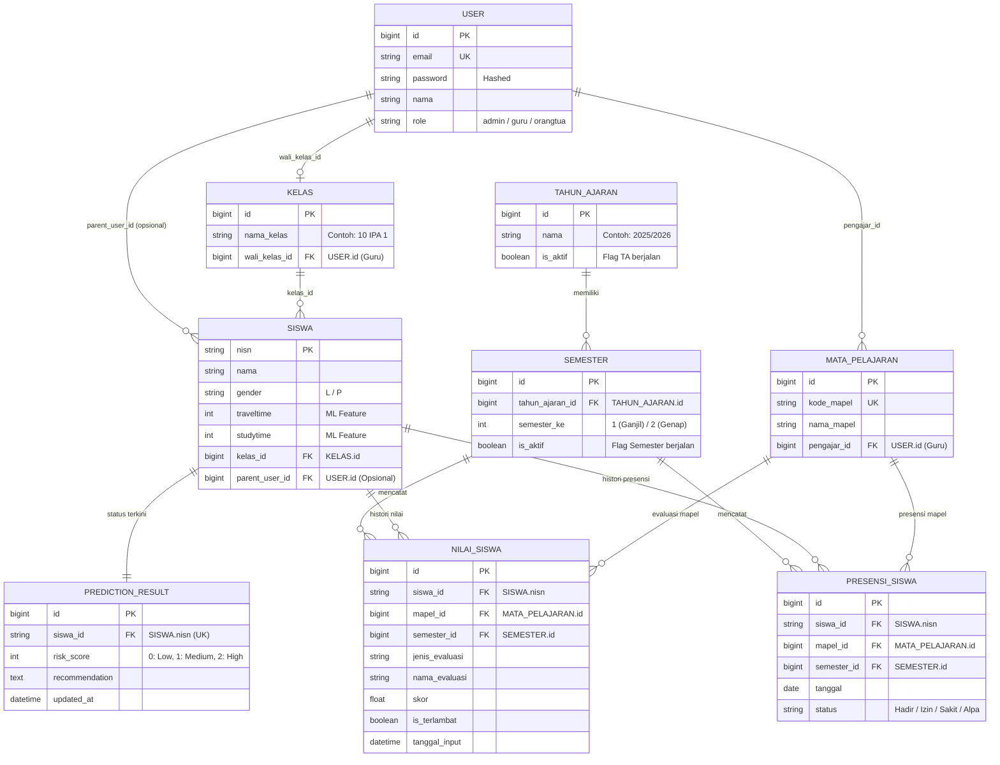

# student-ews-backend

Backend API untuk **Student Early Warning System (EWS)** menggunakan **Django REST Framework**. Sistem ini berfungsi mengelola data akademik, pencatatan transaksi harian (nilai & presensi), serta mengintegrasikan model Machine Learning untuk mengidentifikasi tingkat risiko akademik siswa secara *real-time*.

---

## 📊 Entity Relationship Diagram (ERD)


## 🗂️ Penjelasan Tabel dan Atribut

| Tabel | Atribut Utama | Fungsi & Keterangan |
| :--- | :--- | :--- |
| **`TAHUN_AJARAN`** | `nama`, `is_aktif` | Master periode akademik (misal `"2025/2026"`). Atribut `is_aktif` menentukan tahun ajaran yang sedang berjalan. |
| **`SEMESTER`** | `tahun_ajaran_id`, `semester_ke`, `is_aktif` | Sub-periode akademik (`1` = Ganjil, `2` = Genap). Menjadi *foreign key* acuan pada data transaksi. |
| **`USER`** | `email`, `password`, `role` | Manajemen pengguna sistem dengan 3 role utama (`admin`, `guru`, `orangtua`). |
| **`KELAS`** | `nama_kelas`, `wali_kelas_id` | Rombongan belajar fisik siswa yang diampu oleh seorang guru sebagai Wali Kelas. |
| **`SISWA`** | `nisn`, `traveltime`, `studytime`, `kelas_id` | Data profil siswa. Menyimpan fitur pendukung ML seperti durasi perjalanan (`traveltime`) dan waktu belajar (`studytime`). |
| **`MATA_PELAJARAN`** | `kode_mapel`, `nama_mapel`, `pengajar_id` | Master mata pelajaran beserta guru pengampunya. |
| **`NILAI_SISWA`** | `skor`, `is_terlambat`, `semester_id` | Catatan transaksi evaluasi akademik. Terikat pada `semester_id` untuk pencatatan histori. |
| **`PRESENSI_SISWA`** | `status`, `tanggal`, `semester_id` | Catatan kehadiran harian per mata pelajaran (`Hadir`, `Izin`, `Sakit`, `Alpa`). |
| **`PREDICTION_RESULT`** | `risk_score`, `recommendation`, `siswa_id` | Ringkasan hasil analisis Machine Learning per siswa (`0` = Rendah, `1` = Sedang, `2` = Tinggi). Berelasi 1-to-1 dengan `SISWA`. |

---

## 💡 Hal Penting dalam Arsitektur Basis Data

* **Normalisasi Periode Akademik Tanpa Redundansi**  
  Pergantian semester atau tahun ajaran tidak memerlukan duplikasi data kelas. Entitas `KELAS` bersifat permanen, sedangkan konteks historis sepenuhnya diikat pada tabel transaksi (`NILAI_SISWA` dan `PRESENSI_SISWA`) melalui `semester_id`.

* **Perhitungan Prediksi Berbasis Upsert (1-to-1)**  
  Tabel `PREDICTION_RESULT` menggunakan batasan *Unique Constraint* pada `siswa_id`. Ketika backend menjalankan kalkulasi ulang Machine Learning, data tidak ditumpuk melainkan di-update (`UPDATE OR CREATE`), sehingga performa query dashboard tetap stabil dan instan.

* **Pipelines Agregasi Otomatis untuk Feature ML**  
  Backend mengolah data mentah dari `NILAI_SISWA` (rata-rata skor & frekuensi keterlambatan) dan `PRESENSI_SISWA` (persentase kehadiran), lalu menggabungkannya dengan `traveltime` & `studytime` dari tabel `SISWA` menjadi *feature vector* sebelum diproses oleh model prediksi.

## 🚀 Cara Menjalankan Project (Local Setup)

Petunjuk langkah demi langkah untuk menginstal dan menjalankan server backend secara lokal di komputer Anda.

### 📋 Prasyarat
* **Python** 3.10 atau versi terbaru
* **Git**

---

### 🧰 Langkah-Langkah Instalasi

#### 1️⃣ Clone Repository & Masuk Direktori

```bash
git clone [https://github.com/Ali-321/student-ews-backend.git](https://github.com/Ali-321/student-ews-backend.git)
cd student-ews-backend
```

#### 2️⃣ Buat & Aktifkan Virtual Environment

* **Linux / macOS:**
```bash
python3 -m venv venv
source venv/bin/activate

```


* **Windows (PowerShell / CMD):**
```powershell
python -m venv venv
.\venv\Scripts\activate

```


#### 3️⃣ Install Dependencies

```bash
pip install --upgrade pip
pip install -r requirements.txt

```

#### 4️⃣ Jalankan Migrasi Database

```bash
python manage.py migrate

```

#### 5️⃣ Isi Data Dummy Awal (Opsional)

> 💡 **Info:** Jalankan seeder ini jika Anda membutuhkan data awal master & transaksi untuk keperluan pengujian API.

```bash
python manage.py seed_data

```

#### 6️⃣ Jalankan Server Development

```bash
python manage.py runserver

```

---

### 🌐 Endpoints Akses Lokal

| Layanan | URL / Endpoint | Keterangan |
| --- | --- | --- |
| **API Base URL** | `http://127.0.0.1:8000/api/` | Endpoint REST API untuk Frontend & DS |
| **Django Admin** | `http://127.0.0.1:8000/admin/` | Panel kontrol data master & database |

